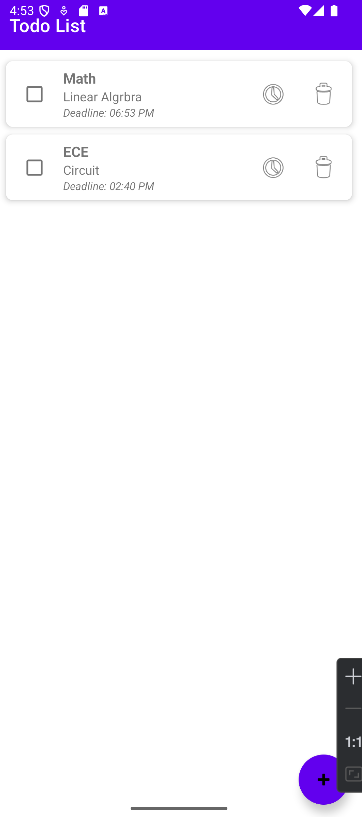

# ToDoList App

A efficient Android task management application built with Kotlin, designed for simplicity and productivity. Below is an example screenshot of the ToDoList App.



## ✨ Key Advantages

- **📱 Modern UI/UX Design** - Clean Material Design interface with intuitive controls
- **⚡ High Performance** - Optimized RecyclerView implementation for smooth scrolling
- **💪 Robust Architecture** - Modular design with clear separation of concerns
- **🔧 Easily Customizable** - Simple structure allows for quick feature additions
- **👆 User-Friendly** - Large touch targets and clear visual feedback

## 🚀 Features

- **📝 Task Creation** - Add tasks with both name and detailed description
- **⏰ Time Deadlines** - Set specific time deadlines for better time management
- **✅ Completion Tracking** - Mark tasks as completed with visual strike-through effect
- **🗑️ Task Management** - Easily delete completed or unnecessary tasks
- **📊 Progress Overview** - Track your productivity with task count display

## ⚙️ Setup and Installation

1. Clone this repository
   ```bash
   git clone https://github.com/Xizhe-Hao/ToDoList_App
2. Open the project in Android Studio
3. Build and run the application

## 📱 How to Use

1. Launch the app to view your task list  
2. Add a task by tapping the + button  
3. Enter task details in the dialog  
4. Manage tasks with checkboxes and buttons:   
    ✓ Check to mark as completed
    🕒 Set deadline with the clock icon
    🗑️ Delete with the trash icon

## License
This project is licensed under the MIT License.